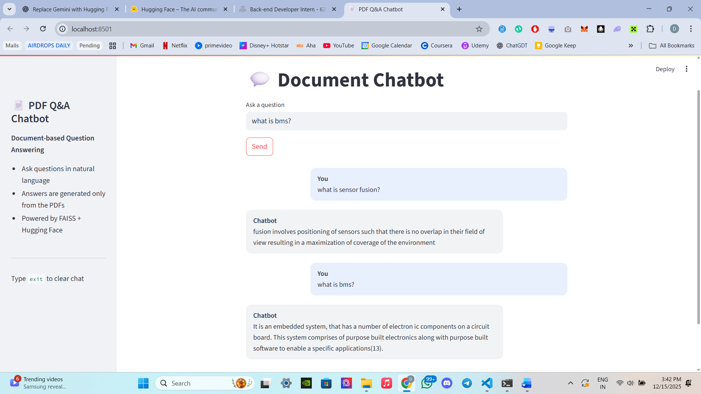

<h1 align="center">Document-QA-Chatbot-RAG</h1>

<p align="center">
A Retrieval-Augmented Generation based Document Question Answering Chatbot
</p>

<p align="center">
  
</p>

---

## Overview

Document-QA-Chatbot-RAG is a document-based Question Answering system built using the Retrieval-Augmented Generation (RAG) approach.  
It enables users to ask natural language questions and receive accurate, context-aware answers extracted directly from PDF documents.

Instead of relying on keyword matching, the system uses semantic embeddings and vector similarity search to retrieve relevant document sections and generates answers using a local language model. The complete pipeline runs locally without external APIs.

---

## Objective

The objective of this project is to design and implement a chatbot that:

- Understands the content of technical PDF documents  
- Matches user queries with relevant document information  
- Generates accurate answers grounded strictly in the document  
- Provides a clean and intuitive user interaction experience  

This project serves as a proof of concept for document intelligence and retrieval-based AI systems.

---

## Key Features

- Multi-document PDF support  
- Semantic search using FAISS  
- Retrieval-Augmented Generation for accurate responses  
- Local Hugging Face embedding and language models  
- Streamlit-based interactive chatbot interface  
- Modular and extensible codebase  

---

## System Architecture

The system follows a standard Retrieval-Augmented Generation pipeline:

1. Document loading and parsing from PDF files  
2. Text cleaning and preprocessing  
3. Recursive chunking to preserve context  
4. Semantic embedding generation using sentence-transformers  
5. Vector storage and retrieval using FAISS  
6. Answer generation using a local language model  
7. User interaction through a Streamlit interface  

---

## User Interface

The chatbot is implemented using Streamlit and provides a clean chat-style interface where users can interact naturally with the system.

The interface supports:
- Natural language question input  
- Clear separation between user queries and chatbot responses  
- Persistent chat history during a session  

---

## Project Structure

```text
document-qa-chatbot-rag/
│
├── faiss_index/
│   ├── index.faiss
│   └── index.pkl
│
├── pdf_data/
│   ├── 5. Battery Management Systems.pdf
│   ├── Sensor Fusion for ADAS.pdf
│   └── PDF_QA_Bot_POC.docx
│
├── screenshots/
│   └── ui.png
│
├── app.py
├── project.ipynb
├── requirements.txt
└── README.md
```


---

## Technology Stack

Python
LangChain
FAISS
Hugging Face Transformers
Sentence Transformers
Streamlit


---
## Installation and Setup

Installation and Setup

Clone the repository:
```text
git clone https://github.com/your-username/document-qa-chatbot-rag.git
cd document-qa-chatbot-rag
```

Install dependencies:
```text
pip install -r requirements.txt
```

Run the application:
```text
streamlit run app.py
```

---

## Example Questions

What is a Battery Management System?

What are the types of BMS?

What is sensor fusion?

What are the use cases of sensor fusion in ADAS?

---


## Notes

The chatbot answers questions strictly based on the content of the provided documents.

If an answer is not found in the documents, the system clearly indicates this.

The FAISS index is stored locally to improve performance across multiple runs.

---


